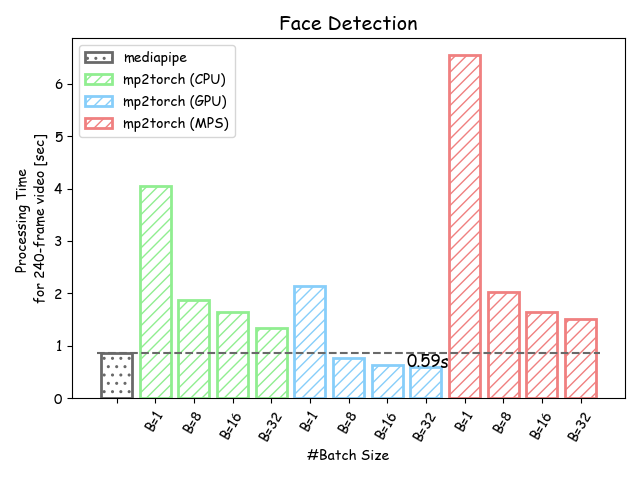
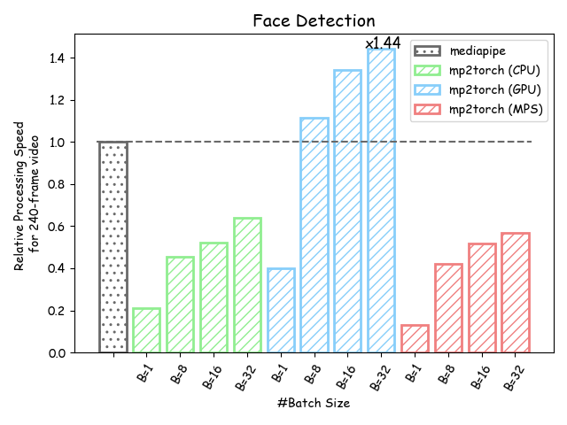
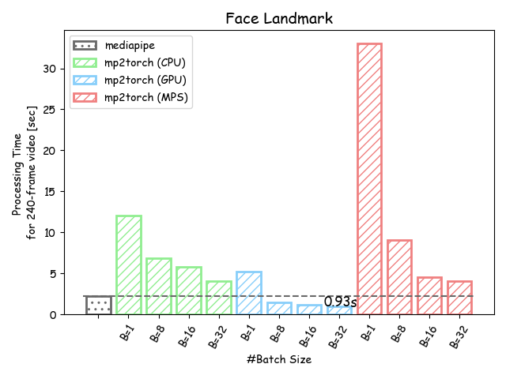
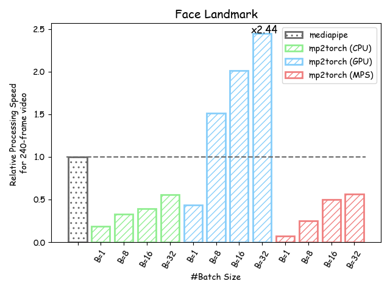

# `mp2torch`
Pytorch Implementaion of [`mediapipe`](https://github.com/google/mediapipe)

⚠️ We use `torchvision` to transform images because of batch processing but `mediapipe` often uses `OpenCV`.
Please use `mp2torch` with caution since the results by `mp2torch` may differ from those by the original `mediapipe` due to the different backend for image transformation.  
As the image size increases, the predictions of `mp2torch` are more likely to differ from the predictions of `mediapipe`.

## Support
### Solutions
- FaceDetection
  - Currently support only short-range detection
- FaceMesh
  - Not support `static_image_mode=False`
### Devices
- CPU
- GPU
- MPS (macOS GPU)
  - slower than cpu even when using batch processing

## Benchmark
### Benchmark environment
| Environment |      OS      |      CPU      |         GPU          |
| :---------: | :----------: | :-----------: | :------------------: |
|     CPU     | Ubuntu22.04  | AMD EPYC 7742 | NVIDIA A100-SXM 80GB |
|     GPU     | Ubuntu22.04  | AMD EPYC 7742 | NVIDIA A100-SXM 80GB |
|     MPS     | macOS Sonoma | Apple M2 Pro  |     Apple M2 Pro     |

### Speed
The speed of processing a single 240-frame video.

#### FaceDetection

|           Processing Time            |                 Relative Time                 |
| :----------------------------------: | :-------------------------------------------: |
|  |  |

<details>
<summary>Table</summary>

| \#batch | `mediapipe` (CPU) | `mp2torch` (CPU) | `mp2torch` (GPU) | `mp2torch` (MPS) |
| ------: | ----------------: | ---------------: | ---------------: | ---------------: |
|       1 |       **0.856 s** |          4.053 s |          2.136 s |          6.541 s |
|       8 |                 - |          1.880 s |      **0.769 s** |          2.030 s |
|      16 |                 - |          1.634 s |      **0.637 s** |          1.652 s |
|      32 |                 - |          1.337 s |      **0.594 s** |          1.508 s |

</details>

#### FaceMesh

|           Processing Time           |                Relative Time                 |
| :---------------------------------: | :------------------------------------------: |
|  |  |

<details>
<summary>Table</summary>

| \#batch | `mediapipe` (CPU) | `mp2torch` (CPU) | `mp2torch` (GPU) | `mp2torch` (MPS) |
| ------: | ----------------: | ---------------: | ---------------: | ---------------: |
|       1 |        **2.268s** |         12.076 s |          5.179 s |         32.993 s |
|       8 |                 - |          6.856 s |      **1.497 s** |          9.015 s |
|      16 |                 - |          5.736 s |      **1.128 s** |          4.569 s |
|      32 |                 - |          4.094 s |      **0.928 s** |          4.007 s |

</details>

## Installation
You can install `mp2torch` through pip:
```sh
$ pip install git+https://github.com/reazon-research/mp2torch.git
```

You can also clone this repository and install it:
```sh
$ git clone https://github.com/reazon-research/mp2torch.git
$ pip install ./mp2torch
```

If you do not have `ffmpeg`, please install `ffmpeg`:
```sh
$ sudo apt install ffmpeg  # UNIX
$ brew install ffmpeg  # macOS
```

## Setup
When you use `python3.10` and `venv` and create a virtual environment in `.venv/`, you can find installed libraries in `.venv/lib/python3.10/site-packages/`.
Please execute the commands below to convert `.tflite` models to `.onnx` models:
```sh
. .venv/bin/activate
$ mkdir -p models/onnx/
$ python -m tf2onnx.convert --opset 16 \
    --tflite .venv/lib/python3.10/site-packages/mediapipe/modules/face_detection/face_detection_short_range.tflite \
    --output models/onnx/face_detection_short_range.onnx
$ python -m tf2onnx.convert --opset 16 \
    --tflite .venv/lib/python3.10/site-packages/mediapipe/modules/face_landmark/face_landmark.tflite \
    --output models/onnx/face_landmark.onnx
```

## Usage

### FaceDetection
You can perform face detection to batch-process one video:
```python
from mp2torch import BlazeFace
from mp2torch.utils import VideoFramesBatchLoader
from tqdm import tqdm

model = BlazeFace(
    onnx_path="./models/onnx/face_detection_short_range.onnx",
    min_score_threshold=0.5,
)
loader = VideoFramesBatchLoader(batch_size=64)
video_path = "..."
for batch, _ in tqdm(loader.make_loader(video_path)):
    outs = model(batch.to(model.device()))  # SegmentedTensor
    # outs = model(batch.to(model.device(), return_device="cpu")  # SegmentedTensor on cpu
    # outs = model(batch.to(model.device()), return_tensors="np")  # list[np.NDArray]
    # outs = model(batch.to(model.device()), return_tensors="list")  # list[list]
    det_results = outs.filterd_detections
    for detections in det_results.get_all_segments():
    	# detections corresponding to an input image in batch
```

You can use the model without any preprocessing or postprocessing:
```python
from mp2torch import FaceDetectionShortRange

model = FaceDetectionShortRange()
batch = ...
bboxes, scores = model(batch)
```

### FaceMesh
You can perform face landmark to batch-process one video:
```python
from mp2torch import FaceLandmarker
from mp2torch.utils import VdieoFramesBatchLoader
from tqdm import tqdm

model = FaceLandmarker(
    onnx_path="./models/onnx/face_landmark.onnx",
    onnx_path_face_detection_short_range="./models/onnx/face_detection_short_range.onnx",
    static_image_mode=True,
    max_num_faces=-1,  # -1 means unlimited detection
    min_detection_confidence=0.5,
    min_tracking_confidence=0.5,
)
loader = VideoFramesBatchLoader(batch_size=64)
video_path = "..."
for batch, _ in tqdm(loader.make_loader(video_path)):
    outs = model(batch.to(model.device()))
    for landmarks in outs.landmarks.get_all_segments():
        # landmarks corresponding to an input image in batch
```

You can use the model without any preprocessing or postprocessing:
```python
from mp2torch import FaceMesh

model = FaceMesh()
batch = ...
landmark_tensors, face_flag_tensor = model(batch)
```

### Utilities

#### VideoFramesBatchLoader
This loads a video and yields batched frames
```python
from mp2torch.utils import VideoFramesBatchLoader

loader = VideoFramesBatchLoader(batch_size=1)
video_path = "..."
for batch, has_frame in loader.make_loader(video_path):
    # process
```

#### VideoBatchLoader
This loads multiple videos in a batch and yields batched frames.
After loading all frames in batch, this loader finishes yielding the batched frames.
If a video has finished loaded, the image corresponding to the video in a batch is represented by a zeros tensor and `has_frame` is set to False.
```python
from mp2torch.utils import VideoBatchLoader

loader = VideoBatchLoader()
video_paths = ["...", ...]
for batch, has_frame in loader.make_loader(video_paths):
    # process
```

#### ImageBatchLoader
This loads multiple images in a batch and yields batched images.
```python
from mp2torch.utils import ImageBatchLoader

loader = ImageBatchLoader(batch_size=32)
image_paths = ["...", ...]
for batch in loader.make_loader(image_paths):
    # process
```

### Benchmark
If you benchmark on your environment, please run these commands:
```sh
$ python scripts/benchmark_facedetection.py --video=$video_path --cpu --cuda
$ python scripts/benchmark_facelandmarker.py --video=$video_path --cpu --cuda
```

You can also benchmark on mps environment:
```sh
$ python scripts/benchmark_facedetection.py --video=$video_path --cpu --mps
```

